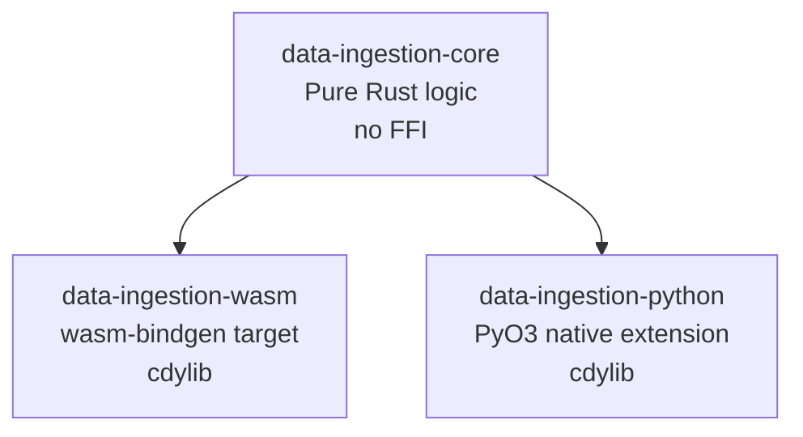

# Data Ingestion Library — Architecture Overview

> **Version:** 1.0.0-draft  
> **Status:** Design Phase  
> **Target:** Rust library with WASM + Python ABI deliverables

---

## Documentation Index

| Document | Contents |
|---|---|
| [`ARCHITECTURE.md`](ARCHITECTURE.md) | This file — overview, directory layout, crate structure, data flow |
| [`DATA_MODELS.md`](DATA_MODELS.md) | IR model structs, DataContract model structs |
| [`MODULES.md`](MODULES.md) | Ingestion, parsing, transformation, serialization layer details |
| [`WASM_STRATEGY.md`](WASM_STRATEGY.md) | WASM compilation, `wasm-bindgen` exports, JS/TS API |
| [`PYTHON_ABI.md`](PYTHON_ABI.md) | PyO3 strategy, class wrappers, `pyproject.toml` |
| [`CRATES_AND_BUILD.md`](CRATES_AND_BUILD.md) | Crate dependency tables, build pipeline, release scripts |
| [`API_AND_ERRORS.md`](API_AND_ERRORS.md) | Public API surface (Rust/WASM/Python), error handling strategy |

---

## 1. Overview

`data-ingestion` is a pure-Rust library that:

1. **Ingests** heterogeneous data format files (JSON, JSON Schema, XML, XSD, data dictionaries)
2. **Parses** them into a unified **Intermediate Representation (IR)**
3. **Transforms** the IR into structured **Data Contracts** (field names, types, nullability, constraints, descriptions, lineage, ownership, SLAs, PII flags, etc.)
4. **Serializes** data contracts to **CSV, YAML, XML, or JSON**

The library compiles to three targets simultaneously:

| Target | Mechanism | Consumer |
|---|---|---|
| Native Rust | `cargo build` | Rust applications |
| WebAssembly | `wasm-pack build` | Web browsers, Node.js, TUI/WASM runtimes |
| Python extension | `maturin build` | Python data engineers |

### Supported Input Formats

| Format | Description |
|---|---|
| JSON Dataset | Raw JSON arrays or objects representing tabular/nested data |
| JSON Schema | `$schema`-annotated documents (Draft 4/7/2019-09/2020-12) |
| Data Dictionary | Tabular CSV/JSON/YAML files describing field metadata |
| Data Schema | Generic schema descriptors (Avro-like, custom) |
| Data Structure | Arbitrary nested JSON/YAML structure files |
| XML | Raw XML data documents |
| XSD | XML Schema Definition files |

### Supported Output Formats

| Format | MIME Type |
|---|---|
| CSV | `text/csv` |
| YAML | `application/yaml` |
| XML | `application/xml` |
| JSON | `application/json` |

---

## 2. Project File & Directory Layout

```
data-ingestion/                          # Cargo workspace root
├── Cargo.toml                           # Workspace manifest
├── Cargo.lock
├── .cargo/
│   └── config.toml                      # WASM target config, linker flags
├── docs/
│   ├── ARCHITECTURE.md                  # This file
│   ├── DATA_MODELS.md
│   ├── MODULES.md
│   ├── WASM_STRATEGY.md
│   ├── PYTHON_ABI.md
│   ├── CRATES_AND_BUILD.md
│   └── API_AND_ERRORS.md
├── plans/                               # Planning artifacts
├── examples/
│   ├── json_to_contract.rs
│   ├── xsd_to_contract.rs
│   └── python_usage.py
├── tests/
│   ├── integration/
│   │   ├── json_ingestion.rs
│   │   ├── xml_ingestion.rs
│   │   ├── xsd_ingestion.rs
│   │   ├── json_schema_ingestion.rs
│   │   └── output_formats.rs
│   └── fixtures/
│       ├── sample.json
│       ├── sample_schema.json
│       ├── sample.xml
│       ├── sample.xsd
│       ├── data_dictionary.csv
│       └── data_dictionary.yaml
│
├── crates/
│   ├── data-ingestion-core/             # Pure Rust, no FFI
│   │   ├── Cargo.toml
│   │   └── src/
│   │       ├── lib.rs
│   │       ├── error.rs
│   │       ├── ingestion/
│   │       │   ├── mod.rs
│   │       │   ├── detector.rs
│   │       │   ├── reader_json.rs
│   │       │   ├── reader_json_schema.rs
│   │       │   ├── reader_data_dict.rs
│   │       │   ├── reader_xml.rs
│   │       │   └── reader_xsd.rs
│   │       ├── ir/
│   │       │   ├── mod.rs
│   │       │   ├── model.rs
│   │       │   └── normalizer.rs
│   │       ├── transform/
│   │       │   ├── mod.rs
│   │       │   ├── contract_builder.rs
│   │       │   ├── type_resolver.rs
│   │       │   ├── constraint_extractor.rs
│   │       │   └── metadata_enricher.rs
│   │       ├── contract/
│   │       │   ├── mod.rs
│   │       │   └── model.rs
│   │       └── output/
│   │           ├── mod.rs
│   │           ├── serializer_csv.rs
│   │           ├── serializer_yaml.rs
│   │           ├── serializer_xml.rs
│   │           └── serializer_json.rs
│   │
│   ├── data-ingestion-wasm/             # WASM target crate
│   │   ├── Cargo.toml
│   │   ├── pkg/                         # wasm-pack output (gitignored)
│   │   └── src/
│   │       ├── lib.rs
│   │       ├── bindings.rs              # wasm_bindgen exports
│   │       └── utils.rs                 # JS interop helpers
│   │
│   └── data-ingestion-python/           # PyO3 native extension crate
│       ├── Cargo.toml
│       ├── pyproject.toml               # maturin config
│       ├── python/
│       │   └── data_ingestion/
│       │       ├── __init__.py
│       │       └── py.typed
│       └── src/
│           ├── lib.rs
│           ├── py_contract.rs           # PyO3 class wrappers
│           ├── py_ingestion.rs          # PyO3 ingestion functions
│           └── py_output.rs             # PyO3 output functions
│
└── scripts/
    ├── build_wasm.sh                    # wasm-pack build script
    ├── build_python.sh                  # maturin build script
    └── build_all.sh                     # Full release build
```

---

## 3. Crate Structure

The workspace uses three crates with a strict dependency hierarchy:



### `data-ingestion-core`

- **Purpose:** All business logic — ingestion, parsing, transformation, serialization
- **Constraints:** No FFI, no platform-specific code; all I/O injected via `&[u8]` slices
- **WASM compatibility:** All code must be `wasm32-unknown-unknown` safe
- **Feature flags:**
  - `default = []`
  - `full` — enables all format readers
  - `json` — JSON + JSON Schema readers
  - `xml` — XML + XSD readers
  - `dict` — Data dictionary reader

### `data-ingestion-wasm`

- **Purpose:** Thin `wasm-bindgen` binding layer over `data-ingestion-core`
- **Output:** `pkg/` directory with `.wasm` binary + JS/TS glue code
- **Constraints:** No `pyo3`; no `std::fs`; `crate-type = ["cdylib"]`

### `data-ingestion-python`

- **Purpose:** Native Python extension module via PyO3 + maturin
- **Output:** `data_ingestion-*.whl` Python wheel
- **Constraints:** No `wasm-bindgen`; `crate-type = ["cdylib"]`

---

## 4. End-to-End Data Flow

```mermaid
graph LR
    INPUT[Raw Input\nbytes or string]
    DETECT[Format Detector\ndetector.rs]
    READ[Format Reader\nreader_*.rs]
    IR[IrDocument\nir/model.rs]
    NORM[IR Normalizer\nnormalizer.rs]
    BUILD[Contract Builder\ncontract_builder.rs]
    CONTRACT[DataContract\ncontract/model.rs]
    SER[Serializer\noutput/]
    OUT[Output\nCSV / YAML / XML / JSON]

    INPUT --> DETECT
    DETECT --> READ
    READ --> IR
    IR --> NORM
    NORM --> BUILD
    BUILD --> CONTRACT
    CONTRACT --> SER
    SER --> OUT
```



### Pipeline Stages

| Stage | Input | Output | Key Types |
|---|---|---|---|
| **Detection** | `&[u8]` + `FormatHint` | `SourceFormat` | `FormatDetector` |
| **Ingestion** | `&[u8]` + `SourceFormat` | `IrDocument` | `FormatReader` trait |
| **Normalization** | `IrDocument` | `IrDocument` | `IrNormalizer` |
| **Transformation** | `IrDocument` | `DataContract` | `ContractBuilder` |
| **Serialization** | `DataContract` | `Vec<u8>` | `ContractSerializer` trait |

---

## 5. Cross-Cutting Concerns

### WASM Compatibility Rules

All code in `data-ingestion-core` must follow these rules to remain `wasm32-unknown-unknown` compatible:

1. No `std::fs` — file I/O is handled by the caller (WASM or Python crate)
2. No `std::thread` — single-threaded execution model
3. No system time via `std::time::SystemTime` on WASM — use `js-sys::Date` in the WASM crate or accept timestamps as parameters
4. UUID generation uses `uuid` crate with `getrandom` feature (WASM-compatible via `js-sys`)
5. Regex compilation uses `once_cell::sync::Lazy` for lazy static initialization

### `#[cfg]` Guards

```rust
// File I/O only available on non-WASM targets
#[cfg(not(target_arch = "wasm32"))]
pub fn ingest_file(path: &std::path::Path) -> Result<DataContract, IngestionError>;

// Timestamp from system clock only on non-WASM
#[cfg(not(target_arch = "wasm32"))]
fn current_timestamp() -> String {
    chrono::Utc::now().to_rfc3339()
}
```

### Error Propagation Chain

```
IngestionError
  └── wraps TransformError
        └── wraps OutputError

WASM:   IngestionError → JsValue (JSON-serialized error object)
Python: IngestionError → PyErr  (mapped to ValueError / IOError / RuntimeError)
```

See [`API_AND_ERRORS.md`](API_AND_ERRORS.md) for full error type definitions.
