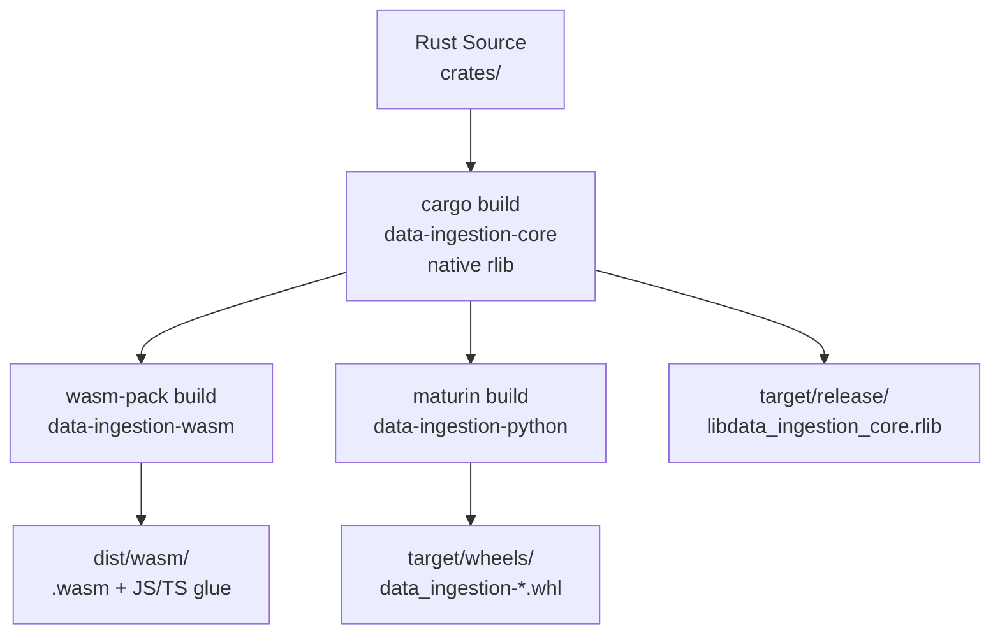

# Crates & Build Pipeline

> Part of the [`data-ingestion`](ARCHITECTURE.md) architecture documentation.

This document covers the workspace `Cargo.toml`, per-crate dependency tables, build pipeline steps, release scripts, and CI configuration.

---

## Table of Contents

1. [Workspace Cargo.toml](#1-workspace-cargotoml)
2. [Per-Crate Cargo.toml Files](#2-per-crate-cargotoml-files)
3. [Crate Selection Rationale](#3-crate-selection-rationale)
4. [Build Pipeline Overview](#4-build-pipeline-overview)
5. [Native Build](#5-native-build)
6. [WASM Build](#6-wasm-build)
7. [Python Wheel Build](#7-python-wheel-build)
8. [Release Scripts](#8-release-scripts)
9. [CI/CD Configuration](#9-cicd-configuration)
10. [cargo config.toml](#10-cargo-configtoml)

---

## 1. Workspace `Cargo.toml`

**File:** [`Cargo.toml`](../Cargo.toml) (workspace root)

```toml
[workspace]
members = [
    "crates/data-ingestion-core",
    "crates/data-ingestion-wasm",
    "crates/data-ingestion-python",
]
resolver = "2"

[workspace.package]
version = "0.1.0"
edition = "2021"
authors = ["0xInfD4t"]
license = "MIT"
repository = "https://github.com/0xInfD4t/data-ingestion"

# ── Shared dependencies (version-pinned here, referenced in crates) ──────────

[workspace.dependencies]

# Serialization
serde       = { version = "1",    features = ["derive"] }
serde_json  = { version = "1" }
serde_yaml  = { version = "0.9" }

# XML parsing and writing
quick-xml   = { version = "0.36", features = ["serialize"] }

# JSON Schema validation
jsonschema  = { version = "0.18", default-features = false }

# CSV
csv         = { version = "1.3" }

# UUID generation (WASM-compatible via getrandom/js feature)
uuid        = { version = "1",    features = ["v4", "serde", "js"] }

# Date/time
chrono      = { version = "0.4",  features = ["serde"] }

# Error handling
thiserror   = { version = "1" }
anyhow      = { version = "1" }

# Regex (type inference + PII detection)
regex       = { version = "1" }
once_cell   = { version = "1" }

# WASM
wasm-bindgen         = { version = "0.2" }
js-sys               = { version = "0.3" }
web-sys              = { version = "0.3" }
console_error_panic_hook = { version = "0.1" }
wasm-bindgen-futures = { version = "0.4" }

# Python
pyo3 = { version = "0.21", features = ["extension-module"] }

# Dev / testing
pretty_assertions = { version = "1" }
```

---

## 2. Per-Crate `Cargo.toml` Files

### `crates/data-ingestion-core/Cargo.toml`

```toml
[package]
name    = "data-ingestion-core"
version.workspace = true
edition.workspace = true

[features]
default = []
full    = ["json", "xml", "dict"]
json    = []   # enables reader_json + reader_json_schema
xml     = []   # enables reader_xml + reader_xsd
dict    = []   # enables reader_data_dict

[dependencies]
serde       = { workspace = true }
serde_json  = { workspace = true }
serde_yaml  = { workspace = true }
quick-xml   = { workspace = true }
csv         = { workspace = true }
uuid        = { workspace = true }
chrono      = { workspace = true }
thiserror   = { workspace = true }
regex       = { workspace = true }
once_cell   = { workspace = true }
jsonschema  = { workspace = true }

[dev-dependencies]
pretty_assertions = { workspace = true }
```

### `crates/data-ingestion-wasm/Cargo.toml`

```toml
[package]
name    = "data-ingestion-wasm"
version.workspace = true
edition.workspace = true

[lib]
crate-type = ["cdylib"]

[features]
default = ["console_error_panic_hook"]

[dependencies]
data-ingestion-core      = { path = "../data-ingestion-core", features = ["full"] }
wasm-bindgen             = { workspace = true }
js-sys                   = { workspace = true }
serde_json               = { workspace = true }
console_error_panic_hook = { workspace = true, optional = true }

[package.metadata.wasm-pack.profile.release]
wasm-opt = ["-Oz", "--enable-mutable-globals"]
```

### `crates/data-ingestion-python/Cargo.toml`

```toml
[package]
name    = "data-ingestion-python"
version.workspace = true
edition.workspace = true

[lib]
name       = "data_ingestion"
crate-type = ["cdylib"]

[dependencies]
data-ingestion-core = { path = "../data-ingestion-core", features = ["full"] }
pyo3                = { workspace = true }
serde_json          = { workspace = true }
```

---

## 3. Crate Selection Rationale

| Crate | Version | Role | WASM-safe | Notes |
|---|---|---|---|---|
| `serde` | 1.x | Serialization framework | Yes | De-facto standard; derive macros |
| `serde_json` | 1.x | JSON parse/emit | Yes | `Value` type used for dynamic IR metadata |
| `serde_yaml` | 0.9 | YAML emit | Yes | Maintained fork; YAML 1.2 support |
| `quick-xml` | 0.36 | XML parse/emit | Yes | Zero-copy SAX + writer API; no C deps |
| `jsonschema` | 0.18 | JSON Schema validation | Yes | Pure Rust; multi-draft support |
| `csv` | 1.3 | CSV read/write | Yes | Handles quoting, BOM, escaping |
| `uuid` | 1.x | UUID v4 generation | Yes | `js` feature uses `crypto.getRandomValues` in WASM |
| `chrono` | 0.4 | Date/time parsing | Yes | ISO 8601 formatting; `serde` feature |
| `thiserror` | 1.x | Error type derivation | Yes | Zero runtime overhead |
| `anyhow` | 1.x | Error propagation in tests | Yes | Used in examples/tests only |
| `regex` | 1.x | Type inference + PII patterns | Yes | Compiled once via `once_cell` |
| `once_cell` | 1.x | Lazy static initialization | Yes | Replaces `lazy_static` |
| `wasm-bindgen` | 0.2 | WASM↔JS bridge | WASM only | Generates JS/TS glue |
| `js-sys` | 0.3 | JS built-in bindings | WASM only | `Date`, `Object`, etc. |
| `console_error_panic_hook` | 0.1 | WASM panic messages | WASM only | Routes panics to `console.error` |
| `pyo3` | 0.21 | Rust↔Python FFI | Native only | Python 3.8+ support |
| `maturin` | 1.4 | PyO3 wheel builder | Build tool | Cross-compilation support |
| `wasm-pack` | 0.13 | WASM build tool | Build tool | Runs `wasm-opt` automatically |

### Why `quick-xml` over `roxmltree` or `xml-rs`

- `quick-xml` supports both **reading** (SAX-style events) and **writing** (builder API) in one crate
- Zero-copy parsing via `&[u8]` slices — no allocation for element names
- WASM-compatible (no C dependencies)
- `roxmltree` is read-only; `xml-rs` is older and slower

### Why `serde_yaml` 0.9 over `serde-yaml` 0.8

- 0.9 is the maintained fork with YAML 1.2 support
- Fixes timestamp auto-parsing issues present in 0.8
- Better handling of multi-document YAML

### Why `jsonschema` over manual validation

- Handles all four JSON Schema drafts automatically
- `default-features = false` disables the `reqwest` HTTP dependency (needed for WASM)
- Provides structured validation errors with JSON Pointer paths

---

## 4. Build Pipeline Overview



---

## 5. Native Build

```bash
# Build the core library only
cargo build --release -p data-ingestion-core

# Build and run all tests
cargo test --workspace

# Build with all features enabled
cargo build --release -p data-ingestion-core --features full

# Run integration tests only
cargo test --test '*' -p data-ingestion-core
```

**Output:** `target/release/libdata_ingestion_core.rlib`

---

## 6. WASM Build

### Prerequisites

```bash
rustup target add wasm32-unknown-unknown
cargo install wasm-pack          # version >= 0.13
```

### Build Commands

```bash
# Bundler target (webpack, vite, rollup) — recommended for web apps
wasm-pack build crates/data-ingestion-wasm \
  --target bundler \
  --out-dir ../../dist/wasm/bundler \
  --release

# Web target (direct <script type="module"> in browser)
wasm-pack build crates/data-ingestion-wasm \
  --target web \
  --out-dir ../../dist/wasm/web \
  --release

# Node.js target (CommonJS require())
wasm-pack build crates/data-ingestion-wasm \
  --target nodejs \
  --out-dir ../../dist/wasm/nodejs \
  --release
```

### Output Structure

```
dist/wasm/bundler/
├── data_ingestion_wasm.js           # ESM JS glue
├── data_ingestion_wasm.d.ts         # TypeScript declarations
├── data_ingestion_wasm_bg.wasm      # WASM binary (~1–2 MB gzipped)
├── data_ingestion_wasm_bg.wasm.d.ts # WASM background TS types
└── package.json                     # npm package manifest
```

### Checking WASM Binary Size

```bash
# Raw size
ls -lh dist/wasm/bundler/data_ingestion_wasm_bg.wasm

# Gzipped size (what browsers actually download)
gzip -k dist/wasm/bundler/data_ingestion_wasm_bg.wasm
ls -lh dist/wasm/bundler/data_ingestion_wasm_bg.wasm.gz

# Profile what's taking space
cargo install twiggy
twiggy top dist/wasm/bundler/data_ingestion_wasm_bg.wasm -n 20
```

---

## 7. Python Wheel Build

### Prerequisites

```bash
pip install maturin          # version >= 1.4
# or
cargo install maturin
```

### Development Install (editable)

```bash
cd crates/data-ingestion-python
maturin develop --release
python -c "import data_ingestion; print(data_ingestion.__version__)"
```

### Production Wheel

```bash
cd crates/data-ingestion-python
maturin build --release --strip
# Output: ../../target/wheels/data_ingestion-0.1.0-cp311-cp311-linux_x86_64.whl

pip install ../../target/wheels/data_ingestion-*.whl
```

### Cross-Compilation (Linux manylinux)

```bash
# Builds manylinux2014 wheels (compatible with most Linux distros)
maturin build --release --strip --manylinux auto

# For aarch64 (ARM) using zig cross-compiler
maturin build --release --strip \
  --target aarch64-unknown-linux-gnu \
  --zig
```

### Supported Python Versions

| Python | CPython ABI tag |
|---|---|
| 3.8 | `cp38` |
| 3.9 | `cp39` |
| 3.10 | `cp310` |
| 3.11 | `cp311` |
| 3.12 | `cp312` |

---

## 8. Release Scripts

### `scripts/build_wasm.sh`

```bash
#!/usr/bin/env bash
set -euo pipefail

SCRIPT_DIR="$(cd "$(dirname "${BASH_SOURCE[0]}")" && pwd)"
ROOT_DIR="$(dirname "$SCRIPT_DIR")"

echo "==> Building WASM targets..."

cd "$ROOT_DIR"

wasm-pack build crates/data-ingestion-wasm \
  --target bundler \
  --out-dir ../../dist/wasm/bundler \
  --release

wasm-pack build crates/data-ingestion-wasm \
  --target web \
  --out-dir ../../dist/wasm/web \
  --release

wasm-pack build crates/data-ingestion-wasm \
  --target nodejs \
  --out-dir ../../dist/wasm/nodejs \
  --release

echo "==> WASM build complete."
echo "    Bundler: dist/wasm/bundler/"
echo "    Web:     dist/wasm/web/"
echo "    Node.js: dist/wasm/nodejs/"

# Print sizes
echo ""
echo "==> Binary sizes:"
ls -lh dist/wasm/bundler/data_ingestion_wasm_bg.wasm
gzip -k -f dist/wasm/bundler/data_ingestion_wasm_bg.wasm
ls -lh dist/wasm/bundler/data_ingestion_wasm_bg.wasm.gz
```

### `scripts/build_python.sh`

```bash
#!/usr/bin/env bash
set -euo pipefail

SCRIPT_DIR="$(cd "$(dirname "${BASH_SOURCE[0]}")" && pwd)"
ROOT_DIR="$(dirname "$SCRIPT_DIR")"

echo "==> Building Python wheel..."

cd "$ROOT_DIR/crates/data-ingestion-python"

maturin build --release --strip --manylinux auto

echo "==> Python wheel build complete."
echo "    Output: $ROOT_DIR/target/wheels/"
ls -lh "$ROOT_DIR/target/wheels/"
```

### `scripts/build_all.sh`

```bash
#!/usr/bin/env bash
set -euo pipefail

SCRIPT_DIR="$(cd "$(dirname "${BASH_SOURCE[0]}")" && pwd)"

echo "========================================"
echo " data-ingestion full release build"
echo "========================================"

echo ""
echo "[1/3] Building native core..."
cargo build --release -p data-ingestion-core

echo ""
echo "[2/3] Building WASM targets..."
"$SCRIPT_DIR/build_wasm.sh"

echo ""
echo "[3/3] Building Python wheel..."
"$SCRIPT_DIR/build_python.sh"

echo ""
echo "========================================"
echo " Build complete!"
echo "========================================"
echo ""
echo "Artifacts:"
echo "  WASM (bundler): dist/wasm/bundler/"
echo "  WASM (web):     dist/wasm/web/"
echo "  WASM (nodejs):  dist/wasm/nodejs/"
echo "  Python wheel:   target/wheels/"
```

---

## 9. CI/CD Configuration

### `.github/workflows/ci.yml` — Tests on every push

```yaml
name: CI

on:
  push:
    branches: [main, develop]
  pull_request:
    branches: [main]

jobs:
  test:
    name: Test (${{ matrix.os }})
    runs-on: ${{ matrix.os }}
    strategy:
      matrix:
        os: [ubuntu-latest, macos-latest, windows-latest]
    steps:
      - uses: actions/checkout@v4
      - uses: dtolnay/rust-toolchain@stable
      - uses: Swatinem/rust-cache@v2
      - run: cargo test --workspace --all-features

  wasm:
    name: WASM Build
    runs-on: ubuntu-latest
    steps:
      - uses: actions/checkout@v4
      - uses: dtolnay/rust-toolchain@stable
        with:
          targets: wasm32-unknown-unknown
      - uses: Swatinem/rust-cache@v2
      - run: cargo install wasm-pack
      - run: bash scripts/build_wasm.sh

  python:
    name: Python Wheel (${{ matrix.python-version }})
    runs-on: ubuntu-latest
    strategy:
      matrix:
        python-version: ["3.8", "3.9", "3.10", "3.11", "3.12"]
    steps:
      - uses: actions/checkout@v4
      - uses: actions/setup-python@v5
        with:
          python-version: ${{ matrix.python-version }}
      - uses: dtolnay/rust-toolchain@stable
      - uses: Swatinem/rust-cache@v2
      - run: pip install maturin
      - run: |
          cd crates/data-ingestion-python
          maturin develop --release
      - run: python -c "import data_ingestion; print(data_ingestion.__version__)"
```

### `.github/workflows/release.yml` — Multi-platform release

```yaml
name: Release

on:
  push:
    tags: ["v*"]

jobs:
  python-wheels:
    name: Python Wheels
    uses: PyO3/maturin-action@v1
    strategy:
      matrix:
        target: [x86_64, aarch64, armv7]
        manylinux: [auto]
    with:
      target: ${{ matrix.target }}
      manylinux: ${{ matrix.manylinux }}
      args: >
        --release --strip
        --manifest-path crates/data-ingestion-python/Cargo.toml
        --out dist
      before-script-linux: |
        yum install -y openssl-devel

  python-wheels-macos:
    name: Python Wheels (macOS)
    runs-on: macos-latest
    steps:
      - uses: actions/checkout@v4
      - uses: PyO3/maturin-action@v1
        with:
          target: universal2-apple-darwin
          args: >
            --release --strip
            --manifest-path crates/data-ingestion-python/Cargo.toml
            --out dist

  python-wheels-windows:
    name: Python Wheels (Windows)
    runs-on: windows-latest
    steps:
      - uses: actions/checkout@v4
      - uses: PyO3/maturin-action@v1
        with:
          target: x86_64
          args: >
            --release --strip
            --manifest-path crates/data-ingestion-python/Cargo.toml
            --out dist

  wasm-release:
    name: WASM Release
    runs-on: ubuntu-latest
    steps:
      - uses: actions/checkout@v4
      - uses: dtolnay/rust-toolchain@stable
        with:
          targets: wasm32-unknown-unknown
      - run: cargo install wasm-pack
      - run: bash scripts/build_wasm.sh
      - uses: actions/upload-artifact@v4
        with:
          name: wasm-dist
          path: dist/wasm/

  publish-pypi:
    name: Publish to PyPI
    needs: [python-wheels, python-wheels-macos, python-wheels-windows]
    runs-on: ubuntu-latest
    steps:
      - uses: actions/download-artifact@v4
        with:
          pattern: wheels-*
          merge-multiple: true
          path: dist
      - uses: pypa/gh-action-pypi-publish@release/v1
        with:
          packages-dir: dist/
```

---

## 10. `cargo config.toml`

**File:** [`.cargo/config.toml`](.cargo/config.toml)

```toml
# WASM target: optimize for binary size
[target.wasm32-unknown-unknown]
rustflags = [
    "-C", "opt-level=z",      # optimize for size
    "-C", "lto=thin",         # thin LTO for smaller binary
]

# Native release: optimize for speed
[profile.release]
opt-level     = 3
lto           = "thin"
codegen-units = 1
strip         = true          # strip debug symbols from native binary
panic         = "abort"       # smaller binary; no unwinding

# WASM release profile (referenced by wasm-pack)
[profile.release-wasm]
inherits      = "release"
opt-level     = "z"
lto           = true
codegen-units = 1
panic         = "abort"
```
