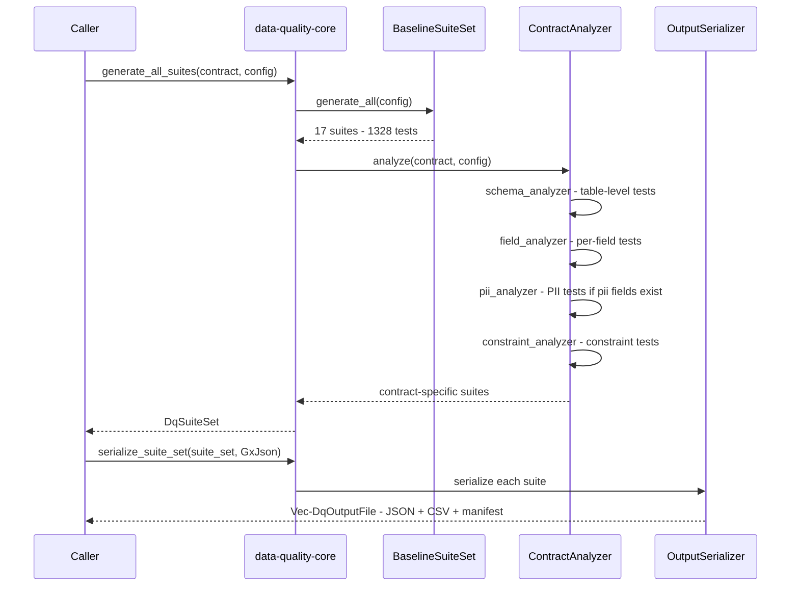
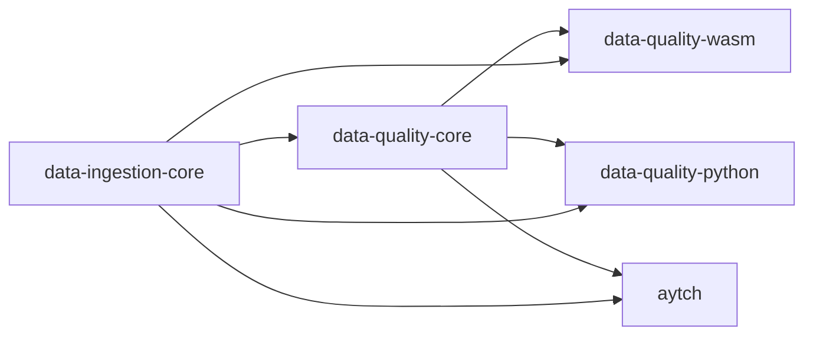

# Data Quality Core — Architecture Overview

> **Version:** 1.0.0-draft
> **Status:** Design Phase
> **Extends:** `data-ingestion` workspace at `d:/Github/0xInfD4t/data-ingestion`
> **Target:** Pure-Rust `data-quality-core` crate + WASM + Python ABI deliverables

---

## Documentation Index

### Data Quality Documents (this feature)

| Document | Contents |
|---|---|
| [`DATA_QUALITY_ARCHITECTURE.md`](DATA_QUALITY_ARCHITECTURE.md) | This file — overview, crate structure, data flow diagrams |
| [`DQ_DATA_MODELS.md`](DQ_DATA_MODELS.md) | All structs: `DqConfig`, `ExpectationConfig`, `ExpectationSuite`, `DqSuiteSet`, `DqOutputFile`, `DqError`, public API, `Cargo.toml` |
| [`DQ_EXPECTATIONS.md`](DQ_EXPECTATIONS.md) | `Expectation` trait, 19+ built-in GX types, 19 custom expectations, serializer rules |
| [`DQ_SUITES_AND_ANALYZER.md`](DQ_SUITES_AND_ANALYZER.md) | `SuiteGenerator` trait, all 17 baseline suites, `ContractAnalyzer`, per-field/schema/PII/constraint rules |
| [`DQ_OUTPUT_AND_BINDINGS.md`](DQ_OUTPUT_AND_BINDINGS.md) | Output module, file structure, WASM `DqEngine`, Python `DqEngine`, CLI extension, test strategy |

### Existing Ingestion Documents

| Document | Contents |
|---|---|
| [`ARCHITECTURE.md`](ARCHITECTURE.md) | Existing ingestion library overview |
| [`DATA_MODELS.md`](DATA_MODELS.md) | IR model structs, DataContract model structs |
| [`MODULES.md`](MODULES.md) | Ingestion, parsing, transformation, serialization layer details |
| [`WASM_STRATEGY.md`](WASM_STRATEGY.md) | WASM compilation strategy |
| [`PYTHON_ABI.md`](PYTHON_ABI.md) | PyO3 strategy |
| [`CRATES_AND_BUILD.md`](CRATES_AND_BUILD.md) | Crate dependency tables, build pipeline |
| [`API_AND_ERRORS.md`](API_AND_ERRORS.md) | Public API surface, error handling |

---

## 1. Overview

`data-quality-core` is a pure-Rust library that generates Great Expectations (GX) 1.x-compatible test suites from `DataContract` structs produced by `data-ingestion-core`.

**What it does:**

1. **Baseline suites** — 17 pre-built suite generators covering 1,328 tests across 16 data quality dimensions (validity, completeness, consistency, accuracy, profiling, integrity, timeliness, sensitivity, uniqueness, business rules, format consistency, volume anomalies, dependency checks, cross-system consistency, performance, security)
2. **Contract-specific suites** — analyzes each `DataContract` to generate targeted expectations from field types, nullability, uniqueness, PII flags, constraints, and foreign keys
3. **Serialization** — outputs GX-compatible JSON/YAML suite files, a CSV summary, and a JSON manifest
4. **Bindings** — exposes a `DqEngine` class via WASM (`data-quality-wasm`) and Python (`data-quality-python`)
5. **CLI** — extends `aytch` with `--dataquality --type greatexpectations` flags

---

## 2. New Crates

Three new crates are added to the existing Cargo workspace:

```
crates/
  data-quality-core/     <- pure Rust, no FFI
  data-quality-wasm/     <- wasm-bindgen wrapper
  data-quality-python/   <- PyO3 wrapper
```

**Updated workspace `Cargo.toml` members:**
```toml
[workspace]
members = [
    "crates/data-ingestion-core",
    "crates/data-ingestion-wasm",
    "crates/data-ingestion-python",
    "crates/data-quality-core",       # NEW
    "crates/data-quality-wasm",       # NEW
    "crates/data-quality-python",     # NEW
    "crates/aytch",
]
```

**New workspace dependency:**
```toml
indexmap = { version = "2" }   # stable JSON key ordering for kwargs
```

---

## 3. Directory Layout

```
crates/data-quality-core/
├── Cargo.toml
├── src/
│   ├── lib.rs                          <- public API
│   ├── config.rs                       <- DqConfig
│   ├── error.rs                        <- DqError
│   ├── expectations/
│   │   ├── mod.rs                      <- Expectation trait, core structs
│   │   ├── types.rs                    <- 19+ built-in GX expectation structs
│   │   ├── custom.rs                   <- 19 custom expectations
│   │   └── serializer.rs               <- to_gx_json(), to_gx_yaml()
│   ├── suites/
│   │   ├── mod.rs                      <- SuiteGenerator trait, BaselineSuiteSet
│   │   ├── data_validity.rs            <- DV001-DV095   (95 tests)
│   │   ├── data_completeness.rs        <- DC096-DC165   (70 tests)
│   │   ├── data_consistency.rs         <- DCN166-DCN255 (90 tests)
│   │   ├── data_accuracy.rs            <- DA256-DA355   (100 tests)
│   │   ├── data_profile.rs             <- DP356-DP475   (120 tests)
│   │   ├── data_integrity.rs           <- DI476-DI535   (60 tests)
│   │   ├── data_timeliness.rs          <- DT536-DT615   (80 tests)
│   │   ├── data_sensitivity.rs         <- DS616-DS665   (50 tests)
│   │   ├── data_uniqueness.rs          <- DU666-DU725   (60 tests)
│   │   ├── data_business_rules.rs      <- DBR726-DBR805 (80 tests)
│   │   ├── data_format_consistency.rs  <- DFC806-DFC875 (70 tests)
│   │   ├── data_volume_anomalies.rs    <- DVA876-DVA965 (90 tests)
│   │   ├── data_dependency_checks.rs   <- DDC966-DDC1015 (50 tests)
│   │   ├── cross_system_consistency.rs <- CSC1016-CSC1115 (100 tests)
│   │   ├── performance_metrics.rs      <- PM1116-PM1175  (60 tests)
│   │   └── security_compliance.rs      <- SC1176-SC1328  (153 tests)
│   ├── contract_analyzer/
│   │   ├── mod.rs                      <- ContractAnalyzer, analyze()
│   │   ├── field_analyzer.rs           <- per-field rules
│   │   ├── schema_analyzer.rs          <- table-level rules
│   │   ├── pii_analyzer.rs             <- PII/PHI/PCI rules
│   │   └── constraint_analyzer.rs      <- FieldConstraint -> GX expectations
│   └── output/
│       ├── mod.rs                      <- serialize_suite_set()
│       ├── gx_json.rs                  <- GX JSON bytes
│       ├── gx_yaml.rs                  <- YAML bytes
│       ├── summary_csv.rs              <- summary.csv
│       └── manifest.rs                 <- manifest.json
├── tests/
│   ├── baseline_suite_counts.rs
│   ├── contract_analyzer.rs
│   └── integration.rs
└── examples/
    └── generate_from_contract.rs

crates/data-quality-wasm/
├── Cargo.toml
└── src/lib.rs                          <- DqEngine (wasm-bindgen)

crates/data-quality-python/
├── Cargo.toml
├── pyproject.toml
├── data_quality.pyi
└── src/lib.rs                          <- DqEngine (PyO3)
```

---

## 4. Module Dependency Diagram

```mermaid
graph TD
    A[DataContract\ndata-ingestion-core] --> B[data-quality-core\nlib.rs]

    B --> C[contract_analyzer]
    B --> D[suites - 17 generators]
    B --> E[expectations]
    B --> F[output]

    C --> C1[field_analyzer]
    C --> C2[schema_analyzer]
    C --> C3[pii_analyzer]
    C --> C4[constraint_analyzer]

    D --> D1[data_validity - 95]
    D --> D2[data_completeness - 70]
    D --> D3[data_consistency - 90]
    D --> D4[data_accuracy - 100]
    D --> D5[data_profile - 120]
    D --> D6[data_integrity - 60]
    D --> D7[data_timeliness - 80]
    D --> D8[data_sensitivity - 50]
    D --> D9[data_uniqueness - 60]
    D --> D10[data_business_rules - 80]
    D --> D11[data_format_consistency - 70]
    D --> D12[data_volume_anomalies - 90]
    D --> D13[data_dependency_checks - 50]
    D --> D14[cross_system_consistency - 100]
    D --> D15[performance_metrics - 60]
    D --> D16[security_compliance - 153]

    E --> E1[types - 19+ built-in]
    E --> E2[custom - 19 custom]
    E --> E3[serializer]

    F --> F1[gx_json]
    F --> F2[gx_yaml]
    F --> F3[summary_csv]
    F --> F4[manifest]

    B --> G[DqSuiteSet]
    G --> H[data-quality-wasm]
    G --> I[data-quality-python]
    G --> J[aytch CLI]
```



---

## 5. Data Flow Diagram



---

## 6. Crate Dependency Graph



| Crate | Depends On |
|---|---|
| `data-quality-core` | `data-ingestion-core`, `serde`, `serde_json`, `serde_yaml`, `csv`, `uuid`, `thiserror`, `regex`, `once_cell`, `log`, `indexmap` |
| `data-quality-wasm` | `data-quality-core`, `data-ingestion-core`, `wasm-bindgen`, `js-sys`, `serde_json`, `console_error_panic_hook` |
| `data-quality-python` | `data-quality-core`, `data-ingestion-core`, `pyo3`, `serde_json` |
| `aytch` | `data-ingestion-core`, `data-quality-core`, `clap`, `anyhow` |

---

## 7. Quick Reference: Generation Rules

### Contract-Specific Suite Names

| Suite | Name Pattern | Example |
|---|---|---|
| Schema | `<contract_name>_schema_suite` | `order_schema_suite` |
| Field | `<contract_name>_field_suite` | `order_field_suite` |
| PII | `<contract_name>_pii_suite` | `order_pii_suite` |
| Constraints | `<contract_name>_constraints_suite` | `order_constraints_suite` |

### Key Per-Field Rules (summary)

| Field Property | Generated Expectation |
|---|---|
| `nullable = false` | `expect_column_values_to_not_be_null` |
| `primary_key = true` | `expect_column_values_to_not_be_null` + `expect_column_values_to_be_unique` |
| `unique = true` | `expect_column_values_to_be_unique` |
| `LogicalType::Email` | `expect_column_values_to_be_valid_email` (custom) |
| `LogicalType::Uuid` | `expect_column_values_to_be_valid_uuid` (custom) |
| `LogicalType::Date/DateTime/Timestamp` | `expect_column_values_to_be_dateutil_parseable` |
| `LogicalType::Integer/Long` | `expect_column_values_to_be_of_type` (`"int"`) |
| `LogicalType::Boolean` | `expect_column_values_to_be_in_set` (`[true, false]`) |
| `pii = true` | `expect_column_values_to_be_masked_pii` (custom) |
| `classification = Restricted` | `expect_column_values_to_be_encrypted` (custom) |
| `FieldConstraint::AllowedValues(v)` | `expect_column_values_to_be_in_set` |
| `FieldConstraint::Pattern(p)` | `expect_column_values_to_match_regex` |
| `FieldConstraint::Min + Max` | `expect_column_values_to_be_between` (merged) |

> See [`DQ_SUITES_AND_ANALYZER.md`](DQ_SUITES_AND_ANALYZER.md) for the complete rule tables.

---

## 8. CLI Quick Reference

```bash
# Generate all suites from a single file
aytch --dataquality --src schema.json --output ./expectations --type greatexpectations

# Skip baseline; contract-specific only
aytch --dataquality --src schema.json --output ./expectations \
  --type greatexpectations --no-baseline

# Specific suites only
aytch --dataquality --src schema.json --output ./expectations \
  --type greatexpectations --suites data_validity_suite,data_completeness_suite

# Process a folder recursively
aytch --dataquality --src ./schemas/ --output ./expectations \
  --type greatexpectations --recursive
```

> See [`DQ_OUTPUT_AND_BINDINGS.md`](DQ_OUTPUT_AND_BINDINGS.md) for full CLI implementation details.
